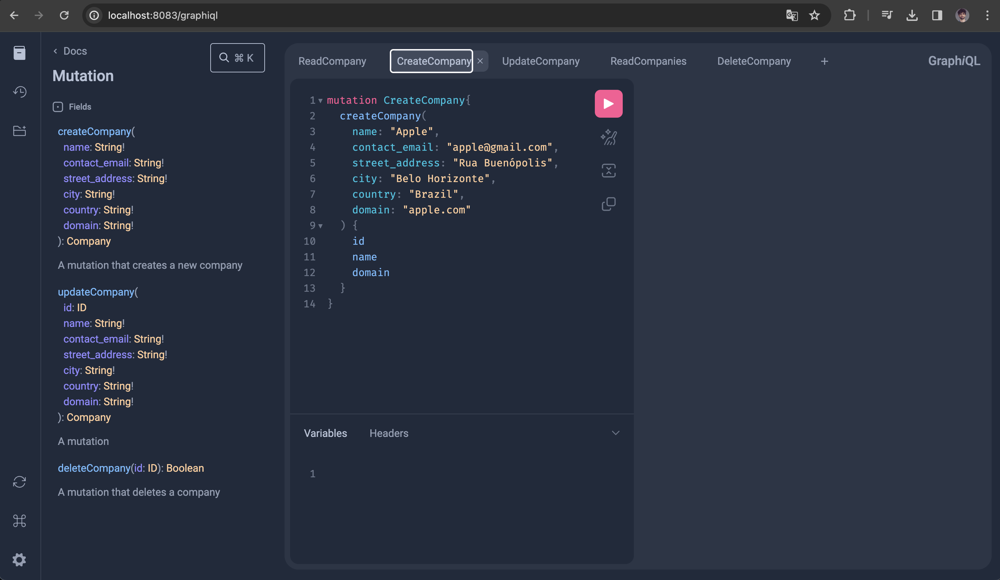

Projeto de API GraphQL feita em Laravel 10 utilizando a biblioteca rebing/graphql-laravel para servir de alternativa à arquitetura REST. 
Este modelo garante suprir as falhas de over-fetching e under-fetching das APIs REST, mas serve apenas de base para que o CRUD seja inspirado para casos futuros.

O ambiente de desenvolvimento foi criado via Docker e está utilizando o Nginx como proxy reverso.

Para utilizar, após o clone do repositório:

1) Suba o container: docker-compose up -d --build

2) Em /api, renomeie o .env.example para .env

3) Acesse o container do php-fpm com:
   3.1) docker ps //para ver o id do container
   3.2) docker exec -it <ID_DO_CONTAINER> bash

5) Rode as migrations com as seeds dentro do container, em /api: php artisan migrate --seed

6) Acesse o /graphiql em: localhost:8083/graphiql (ou troque as portas ao app e db no docker-compose.yaml, caso estejam ocupadas).

7) Navegue pela Docs do GraphQL

Detalhes importantes: 

api/app/GraphQL/: contêm as queries, types e mutations necessários para o CRUD de "Companies".
api/config/graphql.php: contêm os registros do schema: types, queries e mutations do api/app/GraphQL/
